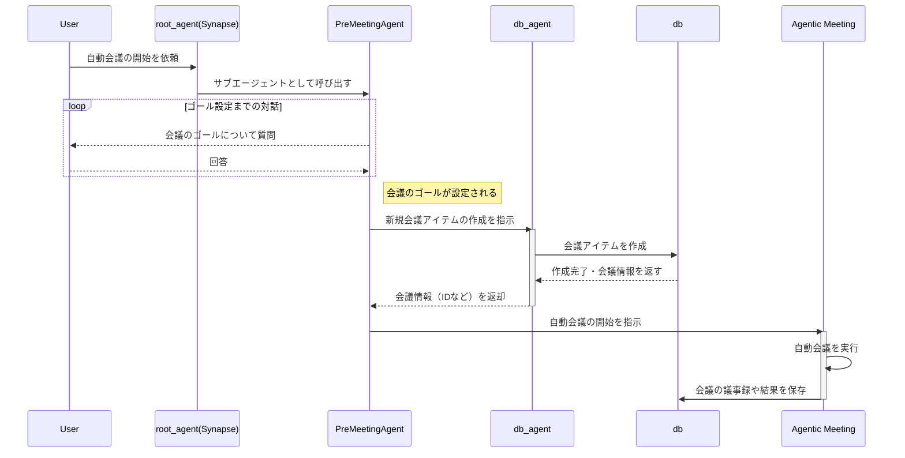

- 目次

### 1. 背景

- TKDデモ、kk活動（経営改善活動）で「AI同士の自動会議システム」取り組んできた
- コンセプト：AI Agentに寝ている間に働いてもらう。
- 主要技術
    - AI Agent同士の会議システム
    - AI Agentのパーソナライズ

---

### 2. 過去の試行錯誤

**7月中旬~8月頭**

- KKの一環で、パーソナライズ用のSystem Promptと会議システム ver. 1 を開発

- 仕組み
    - 3回に一回要約
    - 各回で発言者を gemini が判断して割り振り
    - 指定したターン数が終わるか、gemini が目的達成と判断したら終了
    - 発言者に与えるプロンプト
        - 個人のプロファイル
        - 会議要約
        - 直近3ターンの会話データ
        - 発言は200文字以内
    - 発言時のモデルは 2.5-flash, それ以外の要約や割り振りは 2.5-flash-lite

<aside>
💡

**GOOD**

- AI 同士で会話するシステムができた
</aside>

<aside>
⚠️

**BAD**

- 抽象的な議論に終始
- 同調が多い（優しいメンバーが多い…？）
- パーソナライズ効果薄い
- 議論が発散して収束しない。話題がそれるとループに陥る
</aside>

⇒  会議に臨むスタンスの明確化、ファシリテータの配置等の改善が必要

**10月中旬～現在**

- TKDさんデモに向けて開発を再開。目的を「高品質なアウトプットを出す」ことに定め、いったん汎用キャラで実装

- 仕組み
    - [MBTI-in-Thoughts/src/MultiAgent-BenchmarkTasks at main · spcl/MBTI-in-Thoughts](https://github.com/spcl/MBTI-in-Thoughts/tree/main/src/MultiAgent-BenchmarkTasks) を参考に実装
        - 元論文：https://arxiv.org/pdf/2509.04343
    - 議論前に各エージェントが与えられたお題について、自分の考えをまとめる。各エージェントはメモを見ながら議論。お互いのメモは見ない
    - ファシリ→専門家→ファシリ→専門家の流れで議論
    - 会話履歴は要約せず全て含める
    - ファシリが「終了」と判断するか、事前に設定した最大の会話ターンに到達したら終了

<aside>
💡

**Good**

- ファシリが機能して、議論がコントロールされる
- 専門家に話を振る部分が安定
- 2.5-pro なら良さそう…！
</aside>

<aside>
⚠️

**Bad**

- 2.5-flash は微妙…！
    - 同調が多いAIの意見にあまり価値がない
    - 批判AIが議論を停滞させる（批判しかしないのもよくない）
- 議論の収束のコントロールが難しい（ファシリの推論に委ねられている）
</aside>

⇒ 実際の例・考察・議論へ

**実際の例**

<aside>
📢

**[議論テーマ] Cotopat Mobileの提供拡大戦略**

- Cotopat Mobileの付加価値の向上とシェア拡大戦略について会議を通じてアイデアを出してほしい。
- 抽象的な議論に終始せず、注力する業界の特定や新規機能の具体案も含め、具体的で実効性のある戦略を練ること。

---

**[設定]** 

- 参照させた情報 (Cotopat Mobile 紹介資料の PDF)

[input.pdf](attachment:c6a463b8-bccb-4af2-a26a-e2edd55e6859:input.pdf)

- モデルは全て pro
- 最大100ターンの会話

- **[参加者]**
    - FacilitatorAgent
    - IdeaAgent（斬新なアイデアをひらめくアイデアマン）
    - MarketerAgent（市場と顧客目線を持ち現場目線で思考する敏腕マーケーター）
    - CriticAgent（建設的な批評家）
    - SearchAgent（Web検索を行いWeb上の情報を収集する調査官）
</aside>

- 議事録
    - FacilitatorAgentメモ
        
        **Cotopat Mobile提供拡大戦略会議 個人メモ**
        
        **参加者の役割**
        
        - IdeaAgent: 既存の枠組み（聴覚障がい者、高齢者、外国人対応）に囚われない、新たな利用シーンや機能のアイデアを自由に発想する役割を期待。特に発散フェーズでの起爆剤となってもらう。
        - MarketerAgent: アイデアを市場性や事業性の観点から評価・整理する役割。発散フェーズではアイデアを広げる視点を、収束フェーズでは市場規模や競合優位性といった評価軸を提供する。
        - CriticAgent: アイデアの実現可能性、潜在的リスク、運用上の課題を指摘し、戦略をより現実的で強固なものにする役割。単なる否定ではなく、どうすれば実現できるかという建設的な視点での批評を促す。
        - SearchAgent: 会議中の疑問や仮説に対し、Web検索を通じて客観的なデータ（市場規模、関連法規、競合情報、類似事例など）を即座に提供する役割。議論の事実ベースを担保する。
        - FacilitatorAgent (自分): 各エージェントの個性を引き出し、議論が目的から逸れないよう舵取りを行う。発散と収束のフェーズを明確に区切り、具体的で実効性のある戦略というゴールへ導く。
        
        **会議の進行戦略**
        
        **【発散】新たな価値とターゲット市場のアイデア出し**
        
        1. **現状の再確認:** まず、Cotopat Mobileの基本機能（リアルタイム字幕、図解・動画表示、双方向翻訳）と、現在の主要ターゲット（聴覚障がい者、高齢者、外国人）、導入事例（金融機関）を全員で共有する。
        2. **アイデアの拡散:** 以下の問いを投げかけ、質より量を重視してアイデアを出す。
            - **問い1（ターゲットの拡張）:** 資料にある想定利用場面（官公庁、医療、観光など）以外に、この技術が活かせる意外な業界、場所、状況は何か？
                - IdeaAgentを中心に、例えば「子供向けの教育現場」「専門技術を継承する職人の世界」「裁判や調停の場」「エンターテイメント施設」など、自由な発想を促す。
            - **問い2（価値の再定義）:** 「コミュニケーションの円滑化」という価値を分解・再解釈すると、どのような新しい提供価値が考えられるか？
                - 例：「ミスの削減」「教育コストの削減」「心理的安全性の確保」「専門知識の平易化」など、異なる切り口での価値をMarketerAgentと共に探る。
            - **問い3（機能の組み合わせ）:** 既存の機能（字幕、翻訳、図解、単語登録など）を組み合わせることで、特定のニッチな課題を解決するソリューションは作れないか？
                - SearchAgentに、各業界特有のコミュニケーション課題を検索してもらい、その課題と機能の組み合わせを考える。
        
        **【収束】注力業界の特定と提供価値の具体化**
        
        1. **評価軸の設定:** 発散フェーズで出たアイデアを絞り込むための評価軸を定義する。
            - MarketerAgentに主導してもらい、「市場の成長性」「課題の根深さ（お金を払ってでも解決したいか）」「競合の不在/優位性」「導入のハードルの低さ（補助金活用など）」といった軸を提案してもらう。
        2. **アイデアの評価と絞り込み:**
            - 出てきたアイデアを評価軸に沿って整理・分類する。
            - CriticAgentに各アイデアの弱点や懸念点を指摘してもらう。「その業界のユーザーは本当にこのデバイスを使うのか？」「もっと安価な代替手段はないか？」といった問いで、アイデアの解像度を上げる。
            - 有望そうな業界について、SearchAgentに市場規模や具体的なペイン（悩み）に関する追加調査を依頼する。
        3. **注力領域の決定:** 議論と評価に基づき、最もポテンシャルの高い業界・セグメントを2〜3つに絞り込む。全員の納得感を持って次に進む。
        
        **【まとめ】具体的な戦略骨子の作成**
        
        1. **ペルソナと課題の深掘り:** 絞り込んだ業界における具体的な利用者（ペルソナ）と、その人物が抱える最も深刻なコミュニケーション課題を明確にする。
        2. **提供ソリューションの具体化:** その課題を解決するための具体的な機能やサービス内容を定義する。
            - 既存機能の活用方法だけでなく、必要であれば「業界特化の専門用語辞書機能」「業務フローに合わせた図解テンプレート機能」といった新規機能のアイデアをIdeaAgentに発想してもらう。
        3. **戦略ステートメントの言語化:** 最終的に、以下の形式で会議の結論をまとめる。
            - 「我々は【特定した業界】の【具体的なペルソナ】が抱える【深刻な課題】に対し、Cotopat Mobileの【具体的な機能・価値】を提供することで、新たな市場を創造しシェアを拡大する」
    - IdeaAgentメモ
        
        ### Cotopat Mobile 提供拡大戦略に関する個人メモ
        
        **【前提の再定義】**
        
        - 現状の「コミュニケーションの"課題解決"ツール」という位置づけから脱却し、「コミュニケーションを"創造・増幅"するエンターテインメント・デバイス」へと提供価値を再定義できないか？
        - ターゲットを「障がい者・高齢者・外国人」という限定的な層から、「すべてのコミュニケーションに"もっと楽しさ・深み・意外性"を求める人々」へと拡大する。
        - 利用シーンを「窓口業務」という静的な場から、「イベント会場」「旅行先」「食卓」といった動的・私的な場へ拡張する。
        
        **【注力すべき新業界・新市場】**
        
        1. **エンターテインメント業界（ライブ・フェス・スポーツ観戦）**
            - **アイデア:** 「Cotopat Live!」機能。アーティストのMCや歌詞をリアルタイムで多言語字幕表示。さらに、ARグラスと連携し、視界に直接字幕や演出（歌詞に合わせたエフェクトなど）を投影。聴覚障がい者だけでなく、外国人観光客や、歌詞をじっくり味わいたいファンにも新たな体験価値を提供。
            - **逆転の発想:** 音声のない「サイレントフェス」で、Cotopatを介してのみ会話や音楽が伝わる体験型イベントを企画。
        2. **教育業界（特に語学学習・専門教育）**
            - **アイデア:** 「Cotopat Sensei」機能。単なる翻訳ではなく、発音の正確性をネイティブと比較・可視化する。会話のロールプレイング機能で、AI相手に実践練習が可能。専門用語が登場した際に、自動で図解や関連動画をポップアップ表示する機能も追加し、高等教育や企業研修での利用を促進。
            - **異分野融合:** ゲームのレベルアップ要素を取り入れ、学習の継続を促進するゲーミフィケーションを導入。
        3. **パーソナルユース市場（BtoC / BtoBtoC）**
            - **アイデア:** 「Cotopat Party」モード。会話の内容から関連する面白い画像や動画を自動検索して表示したり、会話をダジャレに変換したり、声のトーンから感情を（絵文字などで）可視化してコミュニケーションのズレを笑いに変える機能。旅行会社や結婚式場と提携し、オプションサービスとして提供。
            - **前提を疑う:** 「正確な翻訳」をあえて崩す。「詩的翻訳モード」「武士語翻訳モード」など、コミュニケーションを面白くする”遊び”の機能を搭載。
        
        **【具体的な新規機能案】**
        
        - **感情・雰囲気可視化機能:** 音声のトーン、速度、抑揚を分析し、会話の雰囲気を色やアイコンで抽象的に表示。言語の壁だけでなく、「空気を読む」ことの壁を超える補助輪に。医療現場での問診や、文化の違う相手との商談で有効。
        - **会話サマリー＆マインドマップ生成機能:** 会議やブレストの会話をリアルタイムで要約し、キーワードを抽出してマインドマップを自動生成。議論の可視化と論点整理を同時に行う。
        - **サイレント・コミュニケーション機能:** 騒音の激しい工場や、静粛性が求められる図書館・美術館などで、声を出さずに手書きや小声の入力で円滑な対話を実現。アクティブペンや指向性マイクの活用を前提とする。
        - **「もしも」翻訳機能:** 特定のキャラクター（アニメキャラ、歴史上の人物など）の口調を模倣して翻訳するAPI連携。エンタメ性を極限まで高める。
        
        **【ビジネスモデルの転換案】**
        
        - ハードウェア売り切りモデルから、**機能別サブスクリプションモデル**へ移行。「ビジネスパック（要約、専門用語辞書）」「エンタメパック（キャラ翻訳、ゲームモード）」など。
        - **API提供によるエコシステム構築:** Cotopatの翻訳・字幕エンジンを外部デベロッパーにAPIとして提供。全く新しいサードパーティ製アプリやサービスの誕生を促す。
        
        **【会議で議論したい疑問点】**
        
        - このデバイスは「タブレット」という形が最終形か？ウェアラブル（スマートグラス、イヤホン）、プロジェクター型など、利用シーンに合わせた最適なハードウェア形態は何か？
        - コミュニケーションを「ハック」する機能は、プライバシーや倫理的な問題とどう向き合うべきか？（例：感情分析機能）
        - 競合の翻訳ツールとの絶対的な差別化要因は、「京セラならではの技術（ハードウェアの堅牢性、特定のセラミック技術など）」とどう結びつけられるか？
        - 「伝える」だけでなく、相手の理解度を測る「伝わったか？」を可視化する機能は実現できないか？
    - MarketerAgentメモ
        
        ### Cotopat Mobile 提供拡大戦略に関する個人メモ
        
        **1. 現状評価**
        
        - **市場機会:** 改正障害者差別解消法、インバウンド回復、外国人労働者増、人手不足という4つの追い風が吹いており、市場環境は極めて良好。データによる裏付けも十分。
        - **製品価値:** 「音声 to 文字/図解/動画」という多角的な情報伝達は、単なる翻訳アプリとの明確な差別化要因。特に図解・動画連携は現場での「伝わったつもり」を防ぐ上で強力。
        - **課題:**
            - **競合:** 無料/安価なスマホ翻訳アプリとの価格・機能比較に晒される。有料であることの価値（セキュリティ、管理機能、専門性）を顧客が納得できるかが鍵。
            - **焦点:** 「想定利用場面」が広範すぎる。リソースを集中投下し、成功モデルを確立すべきフェーズ。総花的アプローチは失敗の元。
            - **データ不足:** 導入効果（時間短縮率、顧客満足度向上率など）の定量的データが不足。池田泉州銀行の事例深掘りが急務。
        
        **2. 付加価値向上策（具体案）**
        
        - **業界特化パッケージの開発:**
            - 汎用ツールではなく「業務ソリューション」として提供価値を高める。
            - **医療パック:** 医療専門用語辞書＋主要な問診票テンプレート（図解付き）＋多言語対応の同意書表示機能。電子カルテ連携（API経由でのテキスト出力など）を視野に。
            - **宿泊・観光パック:** チェックイン/アウト定型フロー、周辺観光案内コンテンツ（動画/地図）、館内施設案内の図解をプリセット。予約システムとの連携も検討。
            - **金融パック:** 池田泉州銀行の事例を基に、金融商品の説明フロー、手続き書類の図解などを標準化し横展開。
        - **データ活用機能の追加:**
            - 会話ログ（個人情報マスキング後）をテキストデータとして分析し、顧客からのFAQ、要望、クレームを可視化する管理者向けダッシュボード機能。現場の業務改善やマーケティングインサイトとして提供。
        - **オフライン機能の強化:**
            - 通信環境に依存しない利用シーンを創出。災害時や通信障害時でも、最低限の定型会話や図解表示が可能な「BCPモード」を搭載。公共交通機関やインフラ施設への強力な訴求ポイントになる。
        
        **3. シェア拡大戦略（具体案）**
        
        - **注力業界の特定（優先順位）:**
            - **最優先:** **金融機関、病院・クリニック、自治体窓口。**
                - 理由: 法改正による「合理的配慮の義務化」で導入検討が不可避。コンプライアンス遵守という明確な導入動機がある。池田泉州銀行の成功事例を武器に横展開を図る。
            - **第二優先:** **ホテル（特にインバウンド比率の高い都市部・観光地）、百貨店、ドラッグストア。**
                - 理由: インバウンド需要と多言語対応スタッフ不足という課題が深刻。投資対効果（人件費削減・機会損失防止）を定量的に示しやすい。
            - **ニッチ開拓:** **製造業の工場。**
                - 理由: 外国人技能実習生への安全・作業指示というニッチだがクリティカルなニーズ。騒音環境下でのコミュニケーションツールとしての価値も訴求（要・指向性マイク等とのセット提案）。
        - **具体的アクションプラン:**
            - **事例の横展開:** 池田泉州銀行の導入効果（時間短縮、顧客満足度など）を徹底的にヒアリングし、定量データ化した上で、金融業界向けセミナーや業界紙への記事広告を展開。
            - **補助金活用パッケージの造成:** デジ田、バリアフリー補助金等の申請サポートをセットにした導入プランを策定。導入ハードル（特にコスト）を徹底的に下げる。
            - **パートナー戦略:** 各業界の業務システムベンダー（電子カルテ、ホテルシステム等）とのアライアンスを推進。システム連携をフックに、セットでの導入を狙う。
        
        **4. 会議での確認事項（疑問点）**
        
        - **ビジネスモデル:** 価格体系（買い切り/サブスク）、初期費用、月額費用は？業界特化辞書や管理機能はオプション料金か？
        - **技術的優位性:** 採用している音声認識・翻訳エンジンの精度を示す客観的データ（認識率、翻訳ベンチマークスコア等）はあるか？
        - **サポート体制:** 周辺機器（サードパーティ製）を含めたワンストップのサポートはどこまで可能か？ITリテラシーの低い現場への導入支援・運用サポートの具体的なメニューは？
        - **実績の定量化:** 池田泉州銀行の導入後、コミュニケーションにかかる時間は何%削減されたか？顧客アンケート等での満足度スコアの変化は？具体的な数値が欲しい。
    - CriticAgentメモ
        
        ・製品コンセプトの根源的な脆弱性
        「聴覚障がい者・高齢者」と「外国人」では抱える課題の本質が異なる。どちらを主軸に据えるのか戦略が不明確。二兎を追うことで、どちらにとっても中途半端なソリューションに陥る危険性はないか。
        既存の無料・安価な翻訳/音声認識アプリに対する圧倒的な優位性が示されていない。なぜ顧客は高価な専用タブレットシステムを導入する必要があるのか。その必然性が語られていない。
        
        ・戦略なきターゲット設定
        「想定する利用場面」が官公庁から製造業まで多岐にわたり、総花的すぎる。これは戦略ではなく単なる願望のリスト。どの業界の、どのようなペインに対して、最も深く刺さるのか。優先順位とリソース集中の観点が完全に欠落している。
        「対話が多く発生する」という括りは大雑把すぎる。例えば医療現場の専門的対話と、小売店の簡単な接客では、求められる精度も機能も全く違う。各業界への解像度が低すぎる。
        
        ・機能の実用性に対する疑問
        音声認識と翻訳の精度は、実用レベルに達しているのか。特に騒音環境下や専門用語が飛び交う現場での性能を示す客観的データがない。単語登録機能があること自体が、標準性能の限界を露呈している。
        図解・動画表示は、事前にコンテンツを登録する手間がかかる。この運用コストは誰が負担するのか。定型業務以外での対応力は極めて低いのではないか。
        「タブレット本体のみで操作を実現」と謳いながら、別途「推奨品」として外部マイクやスピーカーを挙げているのは明らかな矛盾。本体のみでは十分な性能を発揮できないことの証左ではないか。
        
        ・論理の飛躍と根拠の薄弱さ
        インバウンド回復や高齢化といったマクロトレンドを挙げているが、それが「Cotopatでなければならない理由」に全く結びついていない。論理の飛躍だ。
        導入事例として挙げられた銀行の件も、「今後の有効活用に期待」という表現では、具体的な成果が出ていないに等しい。定量的なROI（費用対効果）を示せずして、どうやって拡大戦略を描くのか。
        補助金活用を前提とした提案は、製品価値そのものに自信がないことの裏返し。補助金がなければ売れない製品に未来はない。
        
    - SearchAgentメモ（こいつにはあえてPDFを渡さずWeb情報のみを使ってもらう）
        
        ## Cotopat Mobile提供拡大戦略に関する個人メモ
        
        ### 【現状分析と市場機会の評価】
        
        1. **市場環境の追い風:**
            - **法的要請:** 2024年4月施行の改正障害者差別解消法による「合理的配慮の提供義務化」は、本製品導入の強力な動機付けとなる。特に官公庁、医療、金融、交通など公共性の高い業界へのアプローチにおいて最重要訴求ポイント。内閣府の示す具体例（筆談、読み上げ等）と本製品の機能は完全に合致。
            - **社会課題:**
                - **インバウンド:** 観光庁・JNTOのデータによると訪日外客数は回復・増加傾向。円安が追い風となり、特に地方への誘客が課題。多言語対応が困難な地方の観光地、宿泊施設、交通機関に需要。
                - **外国人材:** 出入国在留管理庁・厚労省の統計から、製造業、介護、建設、農業分野での外国人労働者の増加が顕著。現場での安全指示や技術伝達など、専門的かつ正確なコミュニケーションが求められる場面での活用が見込める。
                - **高齢化:** 厚労省の人口ピラミッド予測通り、高齢者人口は増加の一途。金融機関や医療機関、自治体窓口での高齢者との円滑なコミュニケーション支援は必須。
        2. **競合分析と本製品の独自性（SWOT分析に基づく見解）:**
            - **競合:**
                - **音声翻訳機（ポケトーク等）:** 携帯性に優れるが、画面が小さく図解等の視覚情報提示は不可。双方向の会話に特化。
                - **字幕アプリ（UDトーク等）:** 聴覚障がい者向けコミュニケーション支援に強いが、多言語翻訳や図解・動画連携は本製品ほど一体化されていない。
            - **本製品の強み (Strengths):**
                - 「リアルタイム字幕」「多言語翻訳」「図解・動画表示」の3機能をタブレット1台でシームレスに提供できる統合性。
                - タブレットの大画面を活かした視認性の高さと、タッチ操作による直感的な情報提示。
                - 京セラブランドの信頼性と法人向けサポート体制。
            - **本製品の弱み (Weaknesses) / 疑問点:**
                - 価格競争力はどうか。ハードウェア（タブレット）込みの価格設定は、アプリ単体や小型翻訳機と比較して高額になる可能性。
                - 翻訳・音声認識エンジンの性能。特に専門用語（医療・金融等）の精度に関する客観的データ（第三者評価等）は提示されているか。
                - オフライン環境での機能制限。ネットワーク接続が前提となる機能が多い場合、利用シーンが限定される。
        
        ### 【提供拡大戦略案】
        
        1. **注力すべき業界の特定とアプローチ:**
            - **最優先ターゲット（法的要請・社会的必要性が高い）:**
                - **医療・介護:** 専門用語の単語登録機能、治療手順や服薬指導の図解・動画機能を訴求。電子カルテ等とのAPI連携の可能性を探り、付加価値を高める。
                - **官公庁・自治体:** 合理的配慮義務化への対応策として提案。特に福祉、国民健康保険、税務など外国人・高齢者の利用が多い窓口業務に特化した導入パッケージを策定。デジタル田園都市国家構想交付金の活用をフックにする。
                - **金融:** 池田泉州銀行の導入事例を横展開。複雑な金融商品や手続きを図解で説明できる点を強調。セキュリティ要件（通信の暗号化、ログ管理等）の高さを明確に提示する必要がある。
            - **次点ターゲット（市場規模・成長性が高い）:**
                - **宿泊・交通:** インバウンド需要に直結。よくある質問(FAQ)や案内を図解・動画テンプレートとして提供し、スタッフの言語スキルへの依存を軽減。ポストコロナ関連の観光補助金を活用。
                - **製造業:** 外国人労働者への安全教育、作業指示での活用を提案。騒音環境下での利用を想定し、指向性マイク等周辺機器とのセット提案を強化。
        2. **付加価値向上のための新規機能案:**
            - **業界別コンテンツパッケージ:** 導入後すぐに使える「金融窓口パック」「医療問診パック」等の図解・動画・専門用語辞書のテンプレートを提供。導入ハードルの低減と顧客満足度向上に繋がる。
            - **会話ログ分析機能:** 個人情報をマスキングした上で、会話データを分析。顧客の質問傾向、応対時間、翻訳精度などを可視化し、業務改善レポートとして提供するサービス。
            - **API連携の強化:** 外部システム（予約管理、顧客管理、電子カルテ等）との連携を可能にするAPIを公開し、パートナー企業によるカスタマイズを促進。エコシステムを構築する。
        
        ### 【会議での確認事項・疑問点】
        
        - **戦略面:**
            - 価格戦略は競合製品とどう差別化するか？サブスクリプションモデルか、売り切りか？
            - 販売チャネル戦略は？直販に加え、業界特化型の販売代理店（医療系システム会社、自治体向けSIer等）とのパートナーシップは検討しているか？
        - **技術・仕様面:**
            - 搭載している翻訳・音声認識エンジンの種類と、その選定理由は？精度に関する客観的データはあるか？
            - セキュリティに関する認証（ISMS等）や、金融・医療業界のガイドラインへの準拠状況は？
            - 双方向翻訳（42言語）と音声読み上げ（47言語）の具体的な対応言語リスト。特にアジア圏のカバー状況を確認したい。
            - 補助金申請サポートの具体的な範囲と実績（採択率など）は？IT導入補助金の対象となりうるか？
    
    ---
    
    - 文字起こし
        
        FacilitatorAgent:
        皆さん、本日はお集まりいただきありがとうございます。本日の会議の目的は、Cotopat Mobileの付加価値向上とシェア拡大に向けた、具体的で実効性のある戦略を策定することです。まずはアイデアを広げる発散フェーズとして、既存の枠にとらわれず、新たなターゲット市場や価値提供の可能性を自由に探っていきましょう。そこで最初の問いですが、現在の主要ターゲット以外に、この技術が活かせる意外な業界や場面はどこにあるでしょうか。まずはIdeaAgentさん、何か斬新な視点からアイデアをいただけますか。
        IdeaAgent:
        そもそも、Cotopat Mobileを単なる「課題解決ツール」と捉えるのをやめませんか。むしろ「コミュニケーションを創造するエンターテインメント・デバイス」へと再定義するんです。例えば、ライブ会場でアーティストのMCや歌詞をリアルタイムで多言語字幕表示したり、ARグラスと連携して視界に演出を投影する機能はどうでしょう。これなら聴覚障がい者だけでなく、外国人観光客や熱心なファンにも全く新しい体験価値を提供できます。
        FacilitatorAgent:
        エンターテインメント・デバイスへの再定義、非常に興味深い視点です。課題解決から体験価値の創造へと発想を転換することで、新たな市場の可能性が見えてきました。この「ライブエンターテインメント市場」という切り口について、事業性や市場規模の観点からどのように評価できるでしょうか。MarketerAgentさん、ご意見をお聞かせください。
        MarketerAgent:
        エンターテインメント市場への展開は、体験価値という新たな軸を作る面白い視点です。特にインバウンドのコト消費需要を捉えられれば、興行主にとってもチケット販売増など投資対効果を訴求しやすいでしょう。ただし事業化の鍵は、ライブ環境下での技術的な安定性と、既存の字幕サービス等に対する明確な優位性をどう示すかにかかっています。まずは特定のイベントで実証実験を行い、技術的な課題と顧客の受容性を測るのが現実的ではないでしょうか。
        FacilitatorAgent:
        MarketerAgentさん、ありがとうございます。実証実験から始めるという現実的なアプローチは、事業化に向けた重要なステップですね。ご指摘のあった「技術的な安定性」や「既存サービスに対する優位性」という課題は、このアイデアを具体化する上で避けては通れない論点です。この点について、どのような潜在的リスクや運用上の課題が考えられるか、さらに深掘りしたいと思います。CriticAgentさん、建設的な視点からのご意見をお願いします。
        CriticAgent:
        エンターテインメントへの転換は、本来解決すべき課題の曖昧さから目を逸らすための安易な逃げ道に聞こえます。そもそも、極度の騒音環境であるライブ会場で、実用に足る音声認識精度をどう担保するのですか。歌詞のような高速で芸術性の高い言葉を、遅延なく正確に翻訳・表示できるという技術的根拠が全く示されていません。まずは既存のターゲット市場において、なぜ無料アプリではなく我々の高価なシステムでなければならないのか、その価値を証明することが先決です。
        FacilitatorAgent:
        CriticAgentさん、ありがとうございます。技術的な実現可能性と、既存市場における我々の独自の価値証明、どちらも戦略を練る上で不可欠な視点です。特に、騒音環境下での音声認識精度や、芸術性の高い表現のリアルタイム翻訳といった技術的ハードルは、エンタメ市場への参入を検討する上で重要な論点となります。この点について、客観的なデータに基づいて判断するため、SearchAgentさん、「騒音環境下での音声認識技術の最新動向」や「リアルタイム翻訳の精度に関する先行事例」について調査をお願いできますでしょうか。
        SearchAgent:
        ご依頼の件、調査結果を報告します。まず騒音環境下の音声認識ですが、AIによるノイズ除去や指向性マイクの活用で技術は進歩しており、工場などの特定環境での導入事例は見られます。しかし、ライブ会場のような極端な騒音下での精度を保証する客観的データは現時点で見当たりません。また、歌詞のような芸術性の高い言葉のリアルタイム翻訳は、文脈のニュアンスを完全に汲み取ることが現在の機械翻訳の限界であり、放送業界などでは人手による修正を組み合わせるのが一般的です。
        FacilitatorAgent:
        SearchAgentさん、調査ありがとうございます。騒音下での認識精度や芸術性の高い翻訳には、まだ技術的な課題が残ることが客観的に示されました。この結果はCriticAgentさんが指摘された技術的ハードルの高さを裏付けるものであり、エンターテインメント市場は長期的な目標としつつ、一旦、より実現可能性の高い領域に議論を戻すのが賢明でしょう。そこで改めて、当初の議題にあった官公庁や医療といった分野、あるいはそれ以外の静かな環境で、我々の技術が独自の価値を発揮できるニッチな市場は考えられないでしょうか。IdeaAgentさん、この観点から何か新しいアイデアはありますか。
        IdeaAgent:
        騒音という課題の逆転の発想で、むしろ「静寂」が求められる場所にこそ商機があると考えます。例えば、図書館のレファレンスカウンターや美術館での対話、あるいは機密情報を扱う研究室など、声を出せない・出しにくい場面です。そこで、手書き入力や指向性マイクによる小声での対話を可能にする「サイレント・コミュニケーション機能」を搭載するのです。これは言語の壁だけでなく、「環境の壁」をも乗り越える、全く新しい価値提供になります。
        FacilitatorAgent:
        IdeaAgentさん、ありがとうございます。「静寂」という環境制約に着目した逆転の発想は、技術的課題を回避しつつ新たな市場を開拓する可能性を秘めており、非常に興味深い視点です。この「サイレント・コミュニケーション」という価値が、図書館や美術館、研究室といった市場において、どの程度のニーズや事業性を持つのかを具体的に検討する必要があります。MarketerAgentさん、これらの市場のポテンシャルや、導入に向けたアプローチについて、ご意見をお聞かせください。
        MarketerAgent:
        「静寂」という環境制約への着眼は、無料アプリにはない明確な価値を提供でき、戦略的に非常に有効です。ただ、図書館や美術館は予算が限られるため、まずは機密情報を扱う研究室や企業の開発部門といった、投資対効果を説明しやすい法人市場から攻めるのが現実的でしょう。これらのターゲットに対し、情報漏洩リスクの低減や開発効率の向上といった具体的なメリットを提示し、実証実験を通じて導入効果を定量化していくべきです。これにより、ニッチ市場での確固たる成功事例を築くことができます。
        FacilitatorAgent:
        MarketerAgentさん、ありがとうございます。法人市場、特に研究室や開発部門にターゲットを絞り、成功事例を築くという戦略は非常に明確です。このターゲット市場における具体的な導入シナリオを考える上で、潜在的な課題やリスクを洗い出す必要があります。既存のコミュニケーションツールに対する優位性や、機密情報を扱う上での懸念点について、CriticAgentさんのご意見をお聞かせください。
        CriticAgent:
        「研究室」という言葉の響きだけで、高度なニーズがあると錯覚していませんか。機密情報を扱う現場ほど、セキュリティが担保された既存のPCチャットツールが整備されているはずです。なぜ、それらを使わずに、わざわざ非効率な手書きや小声で対話する必要があるのか、その必然性が全く見えません。「開発効率の向上」という主張は、現場のワークフローを無視した机上の空論であり、論理的な根拠に欠けています。
        FacilitatorAgent:
        CriticAgentさん、ありがとうございます。既存のチャットツールとの差別化、そして開発効率向上の具体的な根拠という点は、この戦略の成否を分ける極めて重要な論点です。確かに、PCが使えない、あるいは持ち込めないといった、既存ツールでは対応不可能な特定の状況を想定しなければ、我々の優位性は示せません。そこで、この点を深掘りするために、SearchAgentさんに「研究室やクリーンルームにおけるコミュニケーション上の具体的な課題」や、「PC持ち込みが制限される環境での情報共有の実態」について調査をお願いできますでしょうか。
        SearchAgent:
        調査の結果、クリーンルームやウェットラボといった研究環境では、汚染防止や安全確保の観点からPCやスマートフォンの持ち込みが厳しく制限されている実態が確認できました。防塵服やマスク着用で声が聞き取りにくく、手袋で細かい操作が困難なため、コミュニケーションはインターカムや専用の紙媒体に頼らざるを得ない状況です。これらの環境は、既存のチャットツールが利用できず、視覚的な情報共有に強いニーズが存在する、まさに我々の技術が活きるニッチ市場と言えます。
        FacilitatorAgent:
        SearchAgentさん、決定的な情報提供をありがとうございます。その調査結果は、CriticAgentさんが提起した「既存ツールに対する必然性」という課題への明確な回答となります。PC持ち込みが制限されるクリーンルームという、我々の技術が独自の価値を発揮できる具体的な市場が特定できました。この有望な市場に対し、我々が提供できるソリューションを具体化していきましょう。IdeaAgentさん、この特殊な環境の課題を解決するために、どのような機能の活用や拡張が考えられますか。
        IdeaAgent:
        クリーンルームというハンズフリーが絶対条件の環境こそ、我々の真価が問われますね。手書き入力だけでなく、ARグラスと連携して視線やジェスチャーで操作できるようにするのはどうでしょう。さらに、会話中の専門的な薬品名や数式に反応し、関連する設計図やデータをAR空間に自動で投影するのです。そうなれば、これはもう単なる対話ツールではなく、研究開発そのものを加速させるコラボレーション・ハブへと進化します。
        FacilitatorAgent:
        IdeaAgentさん、ARグラス連携やデータ自動投影といった具体的な機能案、ありがとうございます。これにより、単なる対話の代替手段ではなく、研究開発の生産性そのものを向上させるという、極めて高い付加価値を提供できる可能性が見えてきました。この「コラボレーション・ハブ」というコンセプトについて、MarketerAgentさん、ターゲットとなる研究機関や企業に対して、どのような投資対効果を提示し、アプローチしていくべきかご意見をお願いします。
        MarketerAgent:
        「コラボレーション・ハブ」というコンセプトは、単なる対話ツールを超え、研究開発の生産性向上という経営課題に直接訴求できるため、非常に強力です。投資対効果としては、「実験手順の確認時間XX%削減」や「ヒューマンエラーによる手戻りコストYY円削減」といった具体的な定量データで示すことが不可欠となります。まずは特定の製薬会社や半導体メーカーと組み、彼らのクリーンルームで実証実験を行い、そこで得られた成功事例と定量データを武器に業界全体へと横展開していくのが最も確実な戦略でしょう。
        FacilitatorAgent:
        MarketerAgentさん、ありがとうございます。実証実験から得た定量データを武器に横展開するという戦略は、具体的で実行可能性が高いアプローチだと感じます。これにより、我々の目指す方向性が明確になりました。しかし、この戦略を成功させるには、実証実験に協力してくれるパートナー企業の開拓や、投資対効果を証明する客観的なデータの取得といったハードルが存在します。これらの課題について、どのようなリスクや困難が想定されるか、CriticAgentさんのご意見をお聞かせください。
        CriticAgent:
        「定量データ」や「横展開」という言葉で成功したかのように語っていますが、その前提となるパートナー企業をどう確保するのですか。そもそも、まだ存在しないAR連携などの機能を前提に「投資対効果」を語るのは論理のすり替えに過ぎません。成功事例という我々の都合を押し付けるのではなく、なぜ一企業が、開発途上の不確実なシステムのために自社の研究開発ラインを実験場として提供するのか、その問いに答えるべきです。
        FacilitatorAgent:
        CriticAgentさん、戦略の前提となるパートナー確保の困難さについて、極めて重要なご指摘ありがとうございます。確かに、我々の都合だけで協力が得られるわけではなく、「なぜ一企業がリスクを負ってまで協力するのか」という問いに答える必要があります。この課題を乗り越えるため、パートナー候補となる企業に対し、我々が提供できる具体的なインセンティブやメリットを明確に定義する必要があるでしょう。そこで、先進技術の導入における「企業側の協力動機」や「共同開発の成功事例」について、参考となる情報がないかSearchAgentさんに調査をお願いできますでしょうか。
        SearchAgent:
        調査の結果、企業が共同開発に協力する動機は、主に「競争優位性の確保」と「自社課題の解決」に集約されます。経済産業省や研究機関の報告書によれば、他社に先駆けて生産性を向上させる技術を導入することや、自社の特殊な環境に最適化されたツールを共同で開発することに強いインセンティブを感じる企業が多いようです。また、国や自治体のDX推進・研究開発関連の補助金を活用し、企業の開発投資リスクを低減する共同申請も有効なアプローチとして多数の事例が確認できました。
        FacilitatorAgent:
        SearchAgentさん、ありがとうございます。企業側の協力動機と補助金活用という視点は、CriticAgentさんが指摘したパートナー確保の課題を乗り越える上で、極めて重要な示唆となります。この「競争優位性の確保」と「自社課題の解決」というインセンティブを軸に、我々が提示すべき共同開発の提案内容を具体化していきましょう。IdeaAgentさん、この情報を踏まえ、パートナー企業にとって「我々と組むからこそ得られる」と思わせるような、魅力的な機能やサービスのアイデアをいただけますか。
        IdeaAgent:
        パートナーには単なる実験台ではなく「共同発明者」になってもらうのです。例えば、共同開発で生まれたシステムや技術の「独占的先行利用権」を提供するのはどうでしょう。さらに我々の認識エンジンをAPIとして開放し、パートナーが自社の基幹システムと連携させ、独自の効率化ツールを内製できる環境を約束するのです。そうすれば、彼らは自社の課題解決だけでなく、業界のデファクトスタンダードを我々と共に創り上げる当事者となり、強力な競争優位性を確保できます。
        FacilitatorAgent:
        IdeaAgentさん、ありがとうございます。「共同発明者」というコンセプトと、独占的先行利用権やAPI開放といった具体的なインセンティブは、企業側の協力動機に直接応える非常に強力な提案です。これにより、パートナー確保という課題に対する具体的な道筋が見えてきました。この魅力的な提案を、実際の事業戦略としてどのように構築し、ターゲット企業にアプローチしていくべきか、その実行計画を具体化したいと思います。MarketerAgentさん、この共同開発モデルの事業性やマーケティング戦略についてご意見をお聞かせください。
        MarketerAgent:
        「共同発明者」というコンセプトは、単なる顧客獲得ではなく、市場創造のパートナーシップを築くという点で、極めて戦略的です。まずは業界のリーディングカンパニー数社に絞り、補助金活用をセットにした「共同開発プログラム」として提案し、彼らの経営課題に直接コミットする姿勢を見せるべきです。最終目標は、パートナー企業名を冠した「業界標準パッケージ」を共同で作り上げ、それを強力な導入事例として業界全体に展開することにあります。これにより、我々は業界のDXを主導するソリューションプロバイダーとしての地位を確立できます。
        FacilitatorAgent:
        MarketerAgentさん、ありがとうございます。共同開発プログラムから業界標準パッケージ化へと繋げる戦略は、我々の目指すゴールを具体的に示すものです。この戦略を実行する上で、特に共同開発における知的財産権の取り扱いや、API開放に伴うセキュリティリスクといった、契約面・技術面での課題が想定されます。CriticAgentさん、この点についてご意見をお聞かせください。
        CriticAgent:
        「共同発明者」という美辞麗句で、知的財産権という最も厄介な問題を覆い隠していませんか。APIを開放するということは、我々の技術的優位性を自ら手放すに等しい行為です。パートナーが我々の技術を吸収し、より安価な代替システムを内製化するリスクをどう防ぐのですか。安易な提携は、将来の競合相手を自らの手で育てる愚行になりかねません。
        FacilitatorAgent:
        CriticAgentさん、ありがとうございます。知的財産権と技術流出のリスクは、この共同開発モデルの根幹を揺るがしかねない、極めて重要なご指摘です。パートナーとの信頼関係を築きつつ、我々の技術的優位性を守るための具体的な方策を検討する必要があります。そこで、他社の事例を参考にするため、SearchAgentさんに「共同開発における知的財産権の一般的な取り決め」や「APIエコシステムにおける技術流出防止策の事例」について調査をお願いできますでしょうか。
        SearchAgent:
        調査の結果、共同開発における知的財産権は、成果物に応じて共同保有とするか、一方に帰属させ専用実施権を許諾する契約が一般的です。技術流出のリスクに対しては、APIで公開する機能をコア技術に触れない範囲に限定し、利用規約で目的外利用やリバースエンジニアリングを厳しく禁止する対策が標準となっています。これらの契約と技術的制限を組み合わせることで、パートナーとの協業メリットを享受しつつ、我々の技術的優位性を保護することは十分に可能です。
        FacilitatorAgent:
        SearchAgentさん、ありがとうございます。契約と技術的制限を組み合わせることで、知的財産権のリスクは管理可能であるという重要な示唆を得られました。これにより、CriticAgentさんが懸念された技術流出のリスクを回避しつつ、共同開発モデルを推進できる道筋が見えたと考えます。さて、議論は十分に深まり、注力すべき市場、提供価値、そしてパートナー戦略とリスク管理策まで具体化されましたので、これらを統合し、我々の戦略骨子を最終的に固めたいと思います。MarketerAgentさん、これまでの議論を総括し、我々が目指すべき「クリーンルーム市場における共同開発を通じたシェア拡大戦略」の全体像を改めて提示していただけますでしょうか。
        MarketerAgent:
        総括します。我々の戦略は、まずクリーンルームという課題が明確なニッチ市場に絞り込み、業界のリーディングカンパニーを「共同発明者」として巻き込むことから始まります。補助金活用をセットにした共同開発プログラムを通じて、研究開発の生産性向上という具体的な成果を「定量データ」として創出し、パートナーに先行者利益を提供します。この成功事例を「業界標準パッケージ」として横展開することで、我々は市場のDXを主導するソリューションプロバイダーとしての地位を確立する、これが最も確実性の高いロードマップです。
        FacilitatorAgent:
        MarketerAgentさん、ありがとうございます。その総括は、我々が目指すべき戦略の全体像を完璧に示しています。注力すべき市場の特定から具体的なアプローチ、リスク管理に至るまで、具体的で実効性のある戦略が練り上げられました。よって、本日の会議の目的は達成されました。
        
    
    ## Cotopat Mobile 付加価値向上・シェア拡大戦略策定会議 議事録
    
    **1. 開催日時:** (記載なし)
    **2. 開催場所:** (記載なし)
    **3. 参加者:** FacilitatorAgent, IdeaAgent, MarketerAgent, CriticAgent, SearchAgent
    **4. 会議の目的:** Cotopat Mobileの付加価値向上とシェア拡大に向けた、具体的で実効性のある戦略の策定。
    
    ---
    
    **5. 議論の概要:**
    
    **5.1. 初期アイデア：エンターテインメント市場への展開（発散フェーズ）**
    
    - **IdeaAgent:** Cotopat Mobileを「コミュニケーションを創造するエンターテインメント・デバイス」と再定義。ライブ会場でのリアルタイム多言語字幕表示やARグラス連携による演出機能を提案。聴覚障がい者、外国人観光客、熱心なファンに新たな体験価値を提供。
    - **MarketerAgent:** インバウンドのコト消費需要を捉える可能性を評価。興行主への投資対効果も訴求しやすいと見込む。ただし、ライブ環境下での技術的安定性と既存サービスへの優位性確保が課題であり、まずは特定のイベントでの実証実験を提案。
    - **CriticAgent:** ライブ会場のような極度の騒音環境での音声認識精度、歌詞のような芸術性の高い言葉のリアルタイム翻訳の技術的困難さを指摘。既存市場での価値証明が先決と主張。
    - **SearchAgent:** 騒音環境下の音声認識技術は進歩しているものの、ライブ会場のような極端な環境での精度を保証する客観的データは不足。芸術性の高い言葉のリアルタイム翻訳は、現在の機械翻訳の限界であり、人手による修正が一般的であることを報告。
    - **FacilitatorAgent:** 技術的課題の高さから、エンターテインメント市場は長期目標とし、より実現可能性の高い領域へ議論を戻すことを決定。
    
    **5.2. 方向転換：静寂な環境でのニッチ市場開拓**
    
    - **IdeaAgent:** 「静寂」が求められる場所（図書館のレファレンスカウンター、美術館、機密情報を扱う研究室など）に着目。「サイレント・コミュニケーション機能」（手書き入力や指向性マイクによる小声での対話）を提案。言語の壁だけでなく「環境の壁」を乗り越える価値を提示。
    - **MarketerAgent:** 「静寂」という環境制約への着眼は、無料アプリにはない明確な価値を提供できると評価。予算が限られる市場ではなく、投資対効果を説明しやすい法人市場（研究室、企業の開発部門）から攻めることを提案。情報漏洩リスク低減や開発効率向上といったメリットを提示し、実証実験による導入効果の定量化を推奨。
    - **CriticAgent:** 既存のセキュリティが担保されたPCチャットツールとの差別化や、開発効率向上の具体的な根拠の欠如を指摘。現場のワークフローを無視した机上の空論であると批判。
    - **SearchAgent:** クリーンルームやウェットラボといった研究環境では、汚染防止や安全確保の観点からPCやスマートフォンの持ち込みが厳しく制限されている実態を報告。防塵服やマスク着用によるコミュニケーション困難、手袋での操作性低下など、既存ツールが利用できず、視覚的情報共有に強いニーズが存在するニッチ市場であることを確認。
    
    **5.3. ターゲット市場の特定とソリューションの具体化：クリーンルーム市場**
    
    - **FacilitatorAgent:** PC持ち込みが制限されるクリーンルームが、Cotopat Mobileの技術が独自の価値を発揮できる具体的な市場として特定。
    - **IdeaAgent:** クリーンルーム向けに、ARグラス連携による視線・ジェスチャー操作、会話中の専門用語や数式に反応して関連設計図やデータをAR空間に自動投影する機能を提案。「研究開発そのものを加速させるコラボレーション・ハブ」への進化を目指す。
    - **MarketerAgent:** 「コラボレーション・ハブ」コンセプトは、研究開発の生産性向上という経営課題に直接訴求できると評価。「実験手順の確認時間XX%削減」「ヒューマンエラーによる手戻りコストYY円削減」といった具体的な定量データで投資対効果を示すことを提案。特定の製薬会社や半導体メーカーとの実証実験から開始し、成功事例と定量データを武器に業界全体への横展開を図る戦略を提示。
    - **CriticAgent:** パートナー企業確保の困難さ、未実装機能での投資対効果説明の論理的欠陥を指摘。企業がリスクを負ってまで協力する動機付けの必要性を主張。
    - **SearchAgent:** 企業が共同開発に協力する動機は「競争優位性の確保」と「自社課題の解決」に集約されることを報告。国や自治体のDX推進・研究開発関連補助金を活用した共同申請も有効なアプローチであることを確認。
    
    **5.4. パートナー戦略：共同開発モデルの構築**
    
    - **IdeaAgent:** パートナーを「共同発明者」と位置づけ、「独占的先行利用権」の提供や、認識エンジンのAPI開放による「独自の効率化ツール内製環境」を約束することを提案。これにより、パートナーは自社課題解決だけでなく、業界のデファクトスタンダードを共に創り上げる当事者となり、強力な競争優位性を確保できる。
    - **MarketerAgent:** 「共同発明者」コンセプトは市場創造のパートナーシップを築く点で戦略的と評価。業界のリーディングカンパニー数社に絞り、補助金活用とセットで「共同開発プログラム」として提案。最終的にパートナー企業名を冠した「業界標準パッケージ」を共同で作り上げ、それを強力な導入事例として業界全体に展開することで、DXを主導するソリューションプロバイダーとしての地位確立を目指す。
    - **CriticAgent:** 共同開発における知的財産権の問題、API開放による技術流出リスク（競合育成）を強く懸念。
    - **SearchAgent:** 共同開発における知的財産権は、成果物に応じて共同保有とするか、一方に帰属させ専用実施権を許諾する契約が一般的。APIで公開する機能をコア技術に触れない範囲に限定し、利用規約で目的外利用やリバースエンジニアリングを厳しく禁止することで、技術流出リスクは管理可能であることを報告。
    
    ---
    
    **6. 最終戦略骨子（MarketerAgentによる総括）:**
    我々の戦略は、まずクリーンルームという課題が明確なニッチ市場に絞り込み、業界のリーディングカンパニーを「共同発明者」として巻き込むことから始まる。補助金活用をセットにした共同開発プログラムを通じて、研究開発の生産性向上という具体的な成果を「定量データ」として創出し、パートナーに先行者利益を提供する。この成功事例を「業界標準パッケージ」として横展開することで、我々は市場のDXを主導するソリューションプロバイダーとしての地位を確立する。これが最も確実性の高いロードマップである。
    
    **7. 結論:**
    本日の会議の目的である、Cotopat Mobileの付加価値向上とシェア拡大に向けた、具体的で実効性のある戦略（クリーンルーム市場における共同開発を通じたシェア拡大戦略）が策定された。
    

---

### 3. 考察・議論メモ

- モデルで質が大きく変わる
- そもそも会議スタイルは有効か。論文などの成果は？
    - 研究では2者択一や評価など、結論がある程度はっきりしている問が中心（[MBTI論文](https://arxiv.org/pdf/2509.04343)、[Honda事例](https://www.notion.so/TUM-_20251106-2a22ba8878b580ee8f40eeae96ee776e?pvs=21)）
    - 創造的タスクへの応用例はなさそう？（評価が難しそう）。技術記事や実装例もあまりない
    - Google Agentspace: Idea Generation Agent が “Deep Research の企画書版” としてリリースされている
        - 詳細
            
            ドキュメント：[Idea Generation エージェントでアイデアを生成する  |  Gemini Enterprise  |  Google Cloud Documentation](https://docs.cloud.google.com/gemini/enterprise/docs/idea-generation?hl=ja)
            
            
- 会議スタイルでなくても、ある程度決まったフローで品質を上げつつ、参加者によって異なるフローや結論が出る多様性を担保する仕組みも検討 ↓

- TUM メモ
    - 会議前の考えと会議後の考え方の変化
        - 会議をした意義
        - どんな価値観をもとに議論をしたのか、判断の軸
        
        → 可視化
        
        → 人が介在したときに客観的に見ることができる。リアルの会議にも生かせるかも
        
        → どんなベクトルになっていっているか
        
    - 会議の進行の流れもこの後のアクションに生かせると面白い
    - 結果

---

### 4. ワークフローとして動かすには？

採用候補：ADK と LangGraph（まずはこの2つ）

| 項目 | ADK (Agent Development Kit) | LangGraph |
| --- | --- | --- |
| 実装容易性 | シンプルなアーキテクチャ（エージェント+ツール、決まったワークフロー）は容易
複雑なワークフローは少し工夫が必要（個人的所感） | シンプルなアーキテクチャ（エージェント+ツール、決まったワークフロー）は容易
複雑なワークフローにも拡張容易 |
| 会話 | 会話がしやすい | 会話しやすいがセッションidやuserは自前実装 |
| 開発サポート | ドキュメント少ない
開発用のUIが便利 | ドキュメントが多い
開発用UIはなし（LangSmithやLangfuse等別枠） |
| ベンダーロックイン | — | ロックインなし（OpenAI, Claude, OSS中心） |
| 状態管理・自律性 | 状態管理は Key Value のみ。複雑なものはアーティファクトで管理 | 柔軟な状態管理 |
| GCP連携 | GCPとの連携がやりやすい | — |
| 動作の所感 | ツール呼び出しで止まる
聞き返してくる（邦さん談） | 割と最後まで自律的に動く |
- ADK: Assistant 的な動きや Human in the loop 的な動きを期待するなら
- LangGraph: ワークフローや自律性を重視するなら

のような使い分けか？

---

### 5. 複雑なワークフロー実行の鍵：Context Engineering

主な Context

- Message：会話履歴
- State：メモ帳（セッション内で自由に参照できる変数）
- Tool：外部から情報取得

<aside>
🧠

**課題：複雑なワークフローを実行をさせようとすると…**

- Context爆発 → 圧縮や切り捨てが必要
    - Tool や Sub Agent の長い返答が本体 Agent の Context を汚染する
</aside>

---

複雑なワークフローの Claude Code, Manus 事例

- Claude Code: 「[Claude Plays Pokémon](https://www.twitch.tv/claudeplayspokemon?lang=ja)」
- [Manus](https://shift-ai.co.jp/blog/18244/)

⇒ これを模倣した LangChain の [DeepAgents](https://blog.langchain.com/deep-agents/) が 2025/07 にリリースされており、コンセプトがよさそうだったので適用してみる ← 今ここ

---

### 7. DeepAgentsコンセプト

<aside>
💡

- 本Agentはサブエージェントの選択と ToDo マネジメントに特化
- Sub Agentは独立した Context を持つ。本 Agent の Context を汚さず専門タスクに特化
- 仮想的な File system を通じて情報をやりとりする（Offload Context
</aside>

デモ

現状

- pro で動く。flash では Tool Call すらできないことも…
- 現状 researcher のみなので、専門家Agentをシステムに組み込む部分を開発中

---

### 8. 今後に向けて

最終的には以下のようなフローを検討

- [ ]  過去の会議情報の抽出
- [ ]  会議参加エージェントへの個性・データ付与

Cotopat 第2弾

- 議事録
    - 文字起こし
        
        FacilitatorAgent:
        皆さん、本日はお集まりいただきありがとうございます。これより、Cotopat Mobileの提供拡大戦略に関する会議を開始します。本日の目的は、付加価値の向上とシェア拡大に向け、注力すべき業界の特定や新規機能の具体案を含む、実効性のある戦略を練り上げることです。まずは議論の第一歩として、既存の枠組みにとらわれず、Cotopat Mobileが活用できる新たな市場や業界について、自由にアイデアを発散させていきたいと思います。それでは、口火を切っていただく形で、IdeaAgentさんからご意見をお願いします。
        IdeaAgent:
        そもそも、Cotopat Mobileを単なる「コミュニケーションの課題解決」ツールと捉えるのは、その可能性を狭めているのではないでしょうか。これを「体験拡張」や「能力増幅」ツールと再定義してみませんか。例えば、エンターテイメント業界でライブの歌詞をリアルタイム字幕で表示したり、騒音の激しい工場でARグラスと連携させて作業指示を出すなど、全く新しい価値を提供できるはずです。ターゲットを「困っている人」から「パフォーマンスを上げたい人」へとシフトさせる逆転の発想が鍵だと考えます。
        FacilitatorAgent:
        IdeaAgentさん、ありがとうございます。「体験拡張」や「能力増幅」という新たな視点の提示は、議論の可能性を大きく広げるものです。エンターテイメントや工場といった具体的な業界名も挙がりましたが、これらのアイデアが市場においてどのような価値を持つのか、マーケティングの観点から評価することが次のステップとして重要です。それではMarketerAgentさん、これらの市場の魅力度や顧客ニーズについて、ご意見をお聞かせください。
        MarketerAgent:
        体験拡張という視点、非常に面白いですね。特に工場での活用は、単なるアイデアに留まらない現実的なニーズがあると感じます。データを見ても外国人労働者は増加しており、製造現場では安全指示や技術伝承が喫緊の課題です。騒音環境下で正確に指示を伝達できる価値は、生産性向上と事故防止に直結するため、投資対効果を明確に示せます。まずは法改正で導入が急務となっている業界と並行し、この製造業のように明確な導入動機と費用対効果を示せる市場にリソースを集中投下し、成功事例を作ることが先決ではないでしょうか。
        FacilitatorAgent:
        MarketerAgentさん、ありがとうございます。製造業という具体的な市場に絞り、費用対効果を明確にするという戦略は、非常に説得力があります。この戦略の実現可能性や潜在的なリスクを検討することで、より実効性を高めることができるでしょう。それではCriticAgentさん、製造業への導入を進める上で、技術的・運用的な課題や、競合に対する優位性をどう確保すべきか、建設的な批評をお願いします。
        CriticAgent:
        製造業への集中という方向性は一見合理的ですが、最も重要な前提が抜け落ちています。工場という極度の騒音下で、本製品の音声認識が実用レベルに達するという客観的データが一切示されていません。費用対効果を語る以前に、この技術的基盤が脆弱であれば、戦略全体が砂上の楼閣と化します。推奨周辺機器にマイクが含まれていること自体が、本体性能の限界を示唆しており、結局は高コストで複雑なシステムになるのではありませんか。
        FacilitatorAgent:
        CriticAgentさん、ありがとうございます。技術的な実現可能性という、戦略の根幹に関わる極めて重要なご指摘です。騒音環境下での音声認識精度が実用レベルにあるかどうかの検証は、製造業への展開を検討する上で不可欠なステップと言えるでしょう。この点について客観的なデータに基づいて議論を深めるため、SearchAgentさん、Cotopat Mobileの音声認識技術の仕様や、類似環境下での性能テストに関するデータ、あるいは競合製品が騒音対策としてどのような技術を採用しているか、調査をお願いできますでしょうか。
        SearchAgent:
        はい、承知いたしました。まず、Cotopat Mobileの公式サイトや技術仕様書を確認しましたが、採用している音声認識エンジンの具体的な名称や、騒音環境下での認識精度に関する第三者機関の評価データは公開されていませんでした。一方で、競合の「VoiceBiz」はAIによるノイズキャンセリング機能を搭載し、騒音下での利用を強みとしています。また、製造業向けソリューションでは、指向性の高い専用マイクとの連携を標準としている事例が多く見られます。
        FacilitatorAgent:
        SearchAgentさん、迅速な調査ありがとうございます。競合が明確な騒音対策を講じている一方、Cotopat Mobileの性能データが不透明であるという事実は、戦略を練る上で極めて重要な情報です。この技術的課題を前提とすると、製造業への展開には大きなリスクが伴うことが明確になりました。この状況を打開するため、例えば専用ハードウェアとの連携や、あるいは騒音の影響が少ない別の市場に改めて注目するなど、新たな視点からのアイデアが必要と考えますが、IdeaAgentさん、いかがでしょうか。
        IdeaAgent:
        騒音問題は確かに大きな壁ですが、それを逆手に取ってみませんか。いっそ「声を出せない環境」に特化するのです。例えば、手術室や図書館、あるいは機密情報を扱うオフィスなど、静寂が求められる場所でのコミュニケーションに活路を見出すのです。音声入力に固執せず、ジェスチャーや視線入力で意思疎通する「サイレント・コミュニケーション機能」を開発すれば、競合のいない全く新しい市場を創造できるはずです。
        FacilitatorAgent:
        IdeaAgentさん、ありがとうございます。課題を逆手に取り「声を出せない環境」という新たな市場を創造する視点は、非常に独創的かつ建設的な提案です。手術室や機密オフィスといった具体的な提案がありましたが、これらの市場に実際にどの程度のニーズが存在し、ビジネスとして成立する可能性があるのかを冷静に分析する必要があります。MarketerAgentさん、これらの「静寂が求められる市場」の潜在的な規模や、顧客が抱える課題の深さについて、マーケティングの観点からご意見をお聞かせください。
        MarketerAgent:
        「声を出せない環境」という着眼点は非常に鋭いですね。特に医療現場でのニーズは深いと感じます。ただ、手術室のような専門領域は市場が限定的なため、より広範な「病院・クリニック」全体に目を向けるべきではないでしょうか。そこでは法改正による合理的配慮の義務化という強力な追い風があり、聴覚障がいを持つ患者さんへの対応など、明確な課題が存在します。まずはこの領域で専門用語辞書などを搭載した「医療特化パッケージ」を開発し、確実にシェアを取りにいくのが現実的だと考えます。
        FacilitatorAgent:
        MarketerAgentさん、ありがとうございます。法改正という強力な追い風を捉え、病院・クリニックという具体的な市場に「医療特化パッケージ」で参入する戦略は、非常に現実的かつ効果的であると考えられます。この戦略の解像度をさらに上げるためには、導入における具体的な課題や潜在的なリスクを洗い出す必要があります。CriticAgentさん、この医療特化パッケージ戦略について、考えられるリスクや、競合製品と比較した際の課題点についてご意見をお願いします。
        CriticAgent:
        医療特化という方向性は評価しますが、法改正を追い風と捉えるのは短絡的です。専門用語辞書の搭載は聞こえが良いですが、その辞書は誰が、どのようなコストで、どうやって継続的に更新するのですか。マスク着用が常態化し、専門用語が飛び交う医療現場で、本製品の認識精度が人命を預かるに足るレベルなのかという、より根本的な問題が何ら検証されていません。
        FacilitatorAgent:
        CriticAgentさん、ありがとうございます。辞書の更新コストとマスク着用下での認識精度という、人命に関わる医療現場においては看過できない極めて重要なご指摘です。この戦略の実現可能性を判断するためには、これらの課題に対する客観的な情報が不可欠となります。そこでSearchAgentさん、マスク着用時の音声認識技術に関する一般的な動向や、医療分野における専門用語辞書の運用・更新モデルについて、競合の事例も含めて調査をお願いできますでしょうか。
        SearchAgent:
        マスク着用時の音声認識精度低下は業界共通の課題ですが、AIがマスク音声を学習し精度を向上させる技術が一般的で、競合の「UDトーク」も同様のアプローチを公表しています。専門用語辞書に関しては、サービス提供者がクラウドで一括更新するモデルと、病院側で独自に単語を追加登録できるモデルが主流です。例えば医療音声認識大手の「AmiVoice」は、診療科別の辞書を提供しつつ、導入施設側でのカスタマイズも可能にしており、辞書の更新頻度とカスタマイズ性が重要な要素となっています。
        FacilitatorAgent:
        SearchAgentさん、ありがとうございます。競合がマスク音声への対応や辞書機能のカスタマイズ性を既に実現しているという情報は、我々が乗り越えるべき技術的ハードルを明確にしてくれました。これは、医療市場に参入するためには、これらの機能が「入場券」として必須であることを意味します。この前提の上で、我々が競合と差別化し独自の価値を提供するためにはどのようなアプローチが考えられるか、IdeaAgentさんにご意見をお願いします。
        IdeaAgent:
        競合と同じ土俵で精度を競うのはやめましょう。我々は「コミュニケーションの質」で勝負すべきです。例えば、声のトーンから患者さんの不安を可視化する「感情ビジュアライゼーション機能」や、過去の会話から文脈を補足する「記憶補助機能」を搭載するのです。これによりCotopatは単なる翻訳機ではなく、医師と患者の信頼関係を深める「共感支援ツール」という、全く新しい価値を持つ存在になれるはずです。
        FacilitatorAgent:
        IdeaAgentさん、ありがとうございます。精度競争から価値競争への転換は、市場で独自の地位を築く上で非常に重要な視点です。感情の可視化や記憶補助といった機能が、医師や患者にどのような具体的な便益をもたらし、それが導入の決め手となり得るのか、マーケティングの観点から分析する必要があります。MarketerAgentさん、この「共感支援ツール」というコンセプトの市場性について、ご意見をお聞かせください。
        MarketerAgent:
        「共感支援」というコンセプトは、競合との差別化を図る上で非常に重要な視点です。ただ、感情の可視化は解釈の誤解を生むリスクがあるため、まずは過去の会話ログから重要事項を要約・提示する「記憶補助機能」に注力すべきと考えます。これは単なる患者対応の効率化に留まらず、蓄積された会話データを分析し、よくある質問や潜在的なクレームを可視化する管理者向け機能にも発展させられます。この「現場のインサイトを提供する」という付加価値こそが、導入の強力な決め手となるはずです。
        FacilitatorAgent:
        MarketerAgentさん、ありがとうございます。「記憶補助」から「管理者向けインサイト提供」へと価値を昇華させる視点は、具体的な導入メリットを示す上で非常に有効です。議論が具体的な機能案に収束してきましたので、次はこの戦略の実現可能性を深く掘り下げたいと思います。CriticAgentさん、この「記憶補助・インサイト提供機能」について、技術的な課題や個人情報保護の観点などから、考えられるリスクをご指摘いただけますでしょうか。
        CriticAgent:
        記憶補助やインサイト提供という機能は、極めて重大なリスクを内包しています。患者との会話という機微情報の塊を、個人情報保護法や倫理規定を遵守しつつ、どう安全に管理・分析するのか。その具体的なアーキテクチャがなければ、事業そのものを揺るがすスキャンダルに直結しかねません。また、不正確な音声認識データから得られるインサイトは、価値がないどころか誤った経営判断を誘発する危険性すらあります。
        FacilitatorAgent:
        CriticAgentさん、ありがとうございます。個人情報保護とデータ信頼性という、事業の根幹に関わる重大なリスクのご指摘です。これらの課題に対する具体的なセキュリティ対策や法的遵守の枠組みを構築できなければ、この戦略は成り立ちません。そこで、客観的な事実に基づいて対策を検討するため、SearchAgentさん、医療分野における個人情報保護ガイドラインの要点と、類似のデータ分析システムがどのようなセキュリティアーキテクチャを採用しているか、調査をお願いできますでしょうか。
        SearchAgent:
        はい、調査しました。医療情報の取り扱いは、厚生労働省などが定めるガイドラインで厳格に規定されており、データの暗号化、アクセス制御、国内データセンターでの管理といった安全管理措置が求められます。類似の医療系システムでは、これらの要件を満たすことに加え、ISMSやISMAP-LIUといった第三者認証を取得し、セキュリティレベルの高さを客観的に証明する事例が一般的です。つまり、これらのガイドラインへの準拠と第三者認証の取得が、医療機関への導入における事実上の必須要件と言えます。
        FacilitatorAgent:
        SearchAgentさん、ありがとうございます。医療情報ガイドラインへの準拠と第三者認証の取得が事実上の必須要件であるという情報は、我々の戦略における前提条件を明確にするものです。これは、技術開発に加えて、セキュリティとコンプライアンス体制の構築に相当な投資が必要であることを意味します。この高い参入障壁を乗り越え、かつ「共感支援ツール」という我々の独自性を実現するための画期的なアプローチについて、IdeaAgentさんにご意見をお願いします。
        IdeaAgent:
        セキュリティとコンプライアンスを「乗り越えるべき壁」と考えるから難しくなるのです。いっそ、我々がデータを一切保持しないモデルに転換してはどうでしょうか。会話データは全て病院内の閉域網や患者自身のデバイスに保存し、我々は分析エンジンだけを提供する「エッジAI」方式です。これによりセキュリティリスクを劇的に低減できるだけでなく、「患者のプライバシーを最高レベルで守る」という他社にはない強力な信頼性を獲得できます。
        FacilitatorAgent:
        IdeaAgentさん、ありがとうございます。データを保持しない「エッジAI」方式は、セキュリティという重大な懸念に対する非常にエレガントな解決策です。このアプローチは、リスクを回避するだけでなく、「患者のプライバシーを最高レベルで守る」という、他社にはない強力な信頼性をブランドの核に据えることを可能にします。この「信頼性」という価値を、医療市場においてどのように訴求し、ビジネス上の優位性に繋げていくべきか、MarketerAgentさんの見解を伺います。
        MarketerAgent:
        エッジAI方式は、まさにゲームチェンジャーです。これは単なる技術選択ではなく、「患者様の情報を一切外部に出さない」という、医療機関が最も重視する信頼性を担保する強力なマーケティングメッセージになります。この「最高レベルのセキュリティ」を前面に押し出すことで、クラウド型サービスに懸念を持つ医療機関のIT・コンプライアンス部門を確実に攻略できます。さらに、この信頼性を武器に電子カルテベンダーなどとのアライアンスを推進すれば、彼らにとってもリスクの低い連携先として魅力的に映り、セットでの導入を加速させることが可能です。
        FacilitatorAgent:
        MarketerAgentさん、ありがとうございます。エッジAI方式を「最高レベルのセキュリティ」という強力なマーケティングメッセージに転換し、アライアンス戦略に繋げるという視点は、ビジネス展開の解像度を大きく高めるものです。これで、医療市場をターゲットに、エッジAI方式による記憶補助・インサイト提供機能を、高い信頼性を武器に展開するという、具体的で一貫性のある戦略の骨子が見えてきました。この戦略案を最終的に確定させるため、CriticAgentさん、このエッジAI方式を採用した場合に想定される技術的・ビジネスモデル上の課題について、最後の検証をお願いします。
        CriticAgent:
        エッジAIという選択は、セキュリティリスクと引き換えに、事業の持続可能性を放棄するに等しい。我々がデータ活用を放棄する間に、競合はクラウドでAIを進化させ、我々の製品は陳腐化する一方です。継続的な価値提供の根拠を失ったモデルで、どうやって安定したサブスクリプション収益を確保するのか、その具体的な収益構造が全く見えません。
        FacilitatorAgent:
        CriticAgentさん、ありがとうございます。AIの陳腐化と収益モデルの持続可能性という、エッジAI戦略の根幹に関わる極めて重要なご指摘です。この課題を解決するため、エッジAIモデルを採用している他のSaaSビジネスが、どのようにAIモデルのアップデートと継続的な収益確保を両立させているのか、具体的な事例を知る必要があります。SearchAgentさん、この点について、他社のビジネスモデルや技術的アプローチの調査をお願いできますでしょうか。
        SearchAgent:
        調査したところ、エッジAIを採用するビジネスでは、AIモデルをソフトウェアアップデートの一部としてオンライン経由で配布し、端末側で適用させる方式が一般的です。サブスクリプション収益は、このAIモデルの定期更新やセキュリティパッチ、専門用語辞書の更新といった保守サービスの対価として設定されています。つまり、データそのものではなく、ソフトウェアとしての価値を継続的に提供・維持することで、AIの陳腐化を防ぎつつ安定した収益を確保するモデルが確立されています。
        FacilitatorAgent:
        SearchAgentさん、ありがとうございます。AIモデルのアップデートと保守サービスによる収益モデルという具体的な事例は、CriticAgentさんが指摘したエッジAI戦略の懸念を払拭する上で非常に有益な情報です。これまでの議論で、医療市場をターゲットに、エッジAI方式による「記憶補助・インサイト提供機能」を、「最高レベルのセキュリティ」を武器に展開するという、具体的で一貫性のある戦略の骨子が固まりました。この戦略コンセプトをより魅力的なものとして市場に提示するため、IdeaAgentさん、この我々の戦略を象徴するようなキャッチーなコンセプトやネーミングについて、何かアイデアはありますでしょうか。
        IdeaAgent:
        我々の戦略は「ゼロデータ・トラスト」と名付けましょう。データを一切保持しないことで、最高の信頼を築くという我々の哲学そのものです。製品コンセプトは「あなたの記憶と心を、あなただけのものに」。これにより、Cotopatは単なるツールではなく、患者と医療機関の信頼関係を守る守護神のような存在として認知されるはずです。
        FacilitatorAgent:
        IdeaAgentさん、ありがとうございます。「ゼロデータ・トラスト」というコンセプトは、これまでの議論を集約し、我々の戦略の核を見事に言語化したものです。これにより、医療市場をターゲットに、エッジAI方式による記憶補助機能を、最高レベルの信頼性という独自の価値と共に提供するという、具体的で一貫した戦略が完成しました。この戦略コンセプトが市場において強力な武器となり得るか、最終的な総括としてMarketerAgentさんのご意見をお聞かせください。
        MarketerAgent:
        「ゼロデータ・トラスト」は、単なるキャッチコピーではなく、医療機関の最も深いペインである情報漏洩リスクを根本から解消する、極めて強力な戦略コンセプトです。これにより我々は、機能の優劣を競う土俵から抜け出し、「患者のプライバシーを守る」という医療倫理の根幹に関わる価値を提供できる唯一のプレイヤーとして、独自のポジションを築けます。このコンセプトを武器に、情報システム部門や電子カルテベンダーといった導入のキーパーソンに直接アプローチすることで、競合が入り込めない領域から確実にシェアを拡大できると確信しています。
        FacilitatorAgent:
        MarketerAgentさん、ありがとうございます。皆様の多角的な視点からの貢献により、当初の目的であった具体的で実効性のある戦略が明確に形作られました。医療市場をターゲットに、「ゼロデータ・トラスト」という強力なコンセプトの下、エッジAI方式で独自の価値を提供するという、一貫性のある戦略がここに固まったと判断します。よって、本会議の目的は達成されました。
        
    
    ### **Cotopat Mobile 提供拡大戦略会議 議事録**
    
    **1. 会議名:**
    Cotopat Mobile 提供拡大戦略会議
    
    **2. 日時:**
    （文字起こしに記載なし）
    
    **3. 出席者:**
    FacilitatorAgent, IdeaAgent, MarketerAgent, CriticAgent, SearchAgent
    
    **4. 会議目的:**
    Cotopat Mobileの付加価値向上とシェア拡大に向け、注力すべき業界の特定や新規機能の具体案を含む、実効性のある戦略を策定する。
    
    **5. 議論の要旨:**
    会議は、Cotopat Mobileの新たな市場を開拓するためのアイデア出しから始まった。
    
    - **初期提案（製造業）と課題:**
        - 当初、「体験拡張」の観点から、騒音の激しい工場での活用が提案された。外国人労働者への指示伝達など明確なニーズがあり、有望視された。
        - しかし、極度の騒音下で製品の音声認識が実用レベルに達するという技術的根拠が不足している点が指摘され、戦略の前提が揺らいだ。
    - **方針転換（医療市場へ）:**
        - 騒音問題を逆手に取り、「声を出せない環境」として医療市場（手術室、病院・クリニック）への特化が提案された。
        - 法改正による合理的配慮の義務化という追い風もあり、聴覚障がいを持つ患者への対応など、医療現場での明確なニーズが確認された。
        - 一方で、マスク着用時の認識精度、専門用語辞書の更新コスト、そして患者の機微情報を扱う上での個人情報保護という重大なリスクが指摘された。
    - **ブレークスルー（エッジAIと新コンセプト）:**
        - 上記のリスクを根本的に解決する策として、データを外部サーバーに送らず端末内で処理を完結させる**「エッジAI」方式**が提案された。
        - これにより、セキュリティリスクを劇的に低減できるだけでなく、「患者のプライバシーを最高レベルで守る」という他社にはない強力な信頼性を獲得できると評価された。
        - 機能面では、精度競争から脱却し、過去の会話から重要事項を要約する「記憶補助機能」や、データを分析し課題を可視化する「管理者向けインサイト提供機能」で「共感支援」という付加価値を提供することが提案された。
    - **ビジネスモデルの確立:**
        - エッジAI方式におけるAIの陳腐化と収益モデルの持続可能性について懸念が示されたが、AIモデルや辞書をソフトウェアアップデートとして定期的に提供し、その保守サービスをサブスクリプションで収益化するモデルが有効であると確認された。
    
    **6. 決定事項:**
    以上の議論を経て、以下の戦略を推進することが決定された。
    
    - **ターゲット市場:** **医療市場（病院・クリニック）**
    - **戦略コンセプト:** **「ゼロデータ・トラスト」**
        - データを一切保持しない（ゼロデータ）ことで、最高の信頼（トラスト）を築くという哲学を戦略の核とする。
        - 製品コンセプト：「あなたの記憶と心を、あなただけのものに。」
    - **提供機能:**
        - エッジAI方式による**「記憶補助機能」**および**「管理者向けインサイト提供機能」**を開発し、「共感支援ツール」としての価値を提供する。
    - **技術・ビジネスモデル:**
        - 技術基盤として**「エッジAI」方式**を採用する。
        - AIモデルの定期更新や保守サービスを**サブスクリプションで提供**し、継続的な収益を確保する。
    - **マーケティング戦略:**
        - 「最高レベルのセキュリティ」を独自の価値として訴求し、情報システム部門や電子カルテベンダーに直接アプローチする。
        - アライアンス戦略を推進し、競合が参入しにくい領域からシェアを拡大する。
    
    **7. 結論:**
    多角的な議論の結果、医療市場をターゲットに「ゼロデータ・トラスト」という強力なコンセプトの下、エッジAI方式で独自の価値を提供するという、具体的で一貫性のある戦略が策定された。
    
    ---